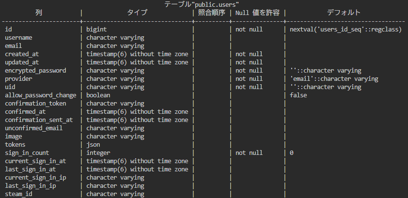
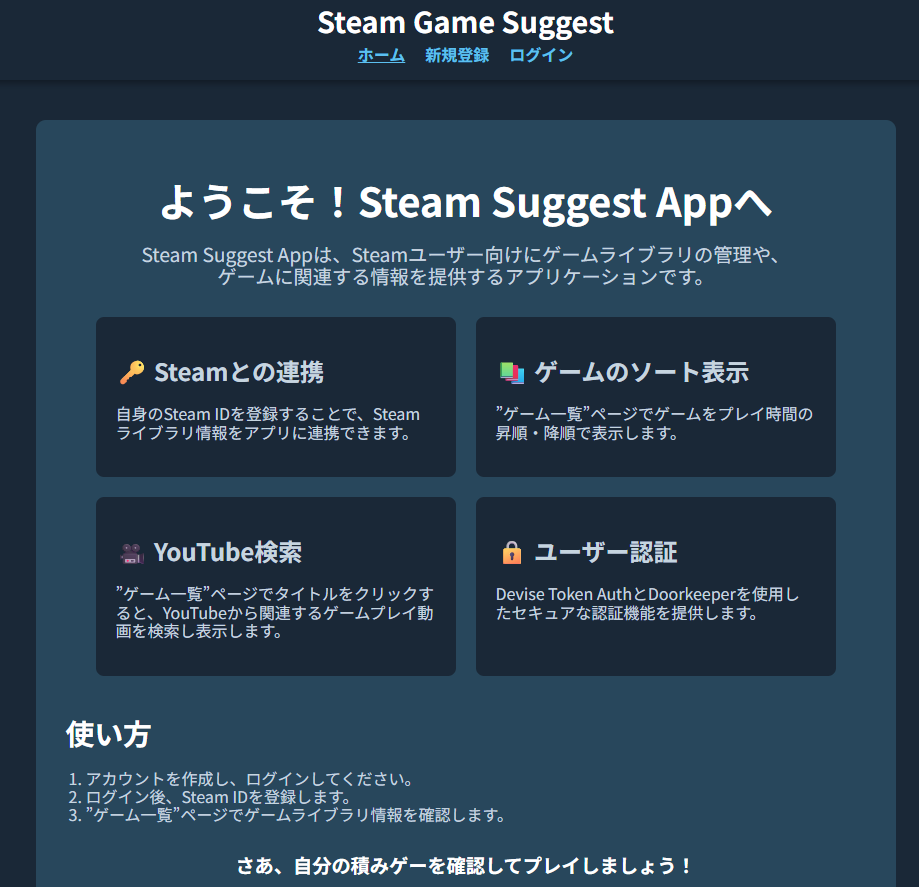
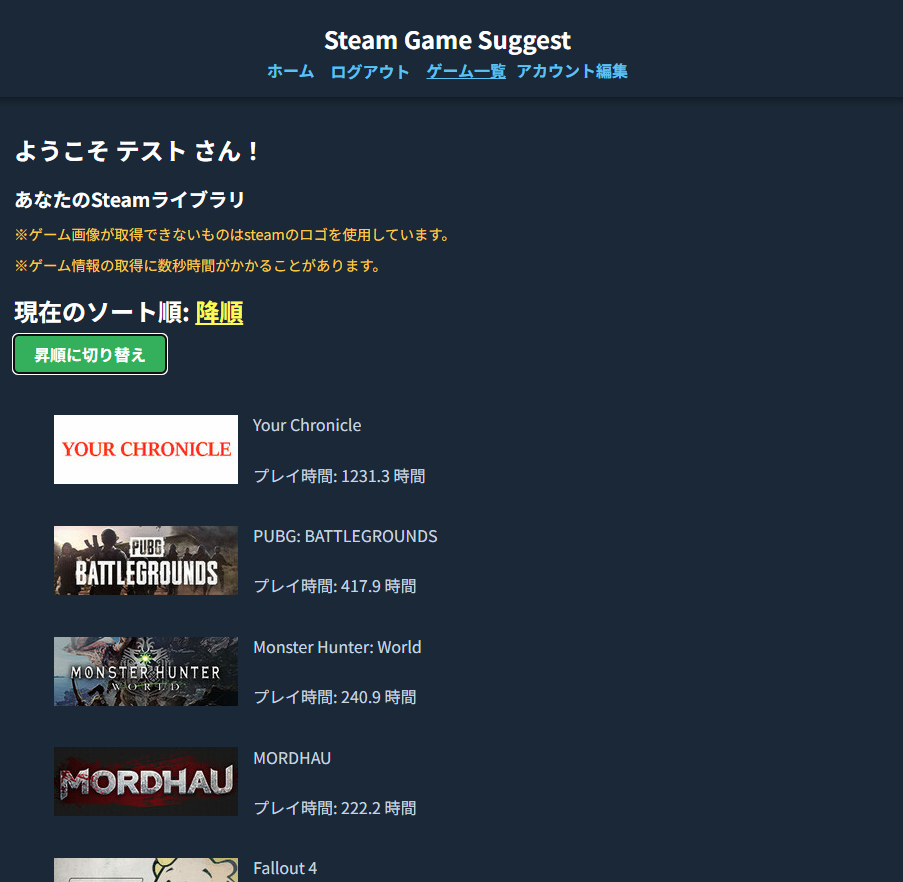
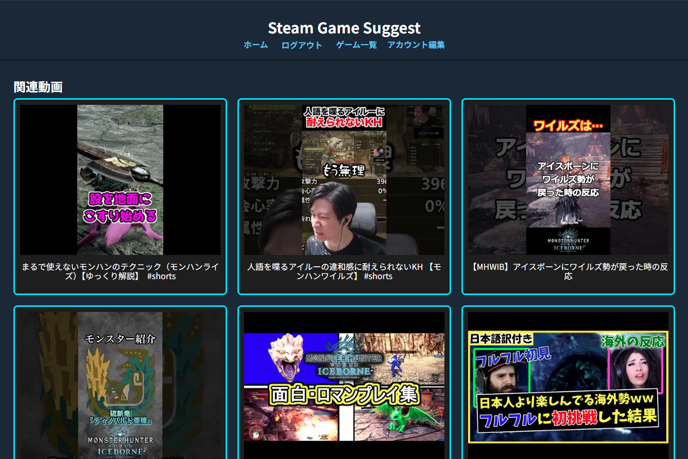

# Steam Suggest App

Steamアカウントと連携して、ユーザーが所有しているゲームライブラリを可視化し、プレイ時間統計やおすすめ動画を提示するWebアプリです。

---

## 🚀 デプロイ済みアプリ

- **URL**: [https://sg-app.jp](https://sg-app.jp)

---

## 🛠 使用技術

### フロントエンド

- 
- 
- （状態管理）
- （API通信）
- 

### バックエンド

- 
- （API通信）
- 
- Devise + Devise Token Auth（トークン認証）

### インフラ・外部サービス

- （バックエンドAPIホスティング）
- （フロントエンドホスティング・DNS設定）
- （SMTPメール送信）
- （APIでゲームデータ取得）
- （APIで動画データ取得）
- （独自ドメイン取得）

---

## 🗄️ usersテーブル

---

## 📷 スクリーンショット

### ホーム画面

### ゲーム一覧

### youtube動画表示

---

## 📄 主な機能

- ユーザー登録（メール認証により二段階認証）
- ログイン（devise token auth使用によりトークンベース認証）
- Steam ID 登録によるゲームライブラリ自動取得
- ゲームプレイ時間の昇順・降順でタイトル表示
- タイトルクリックによりyoutubeから動画取得・表示

---

## 🔗 使用API

- **Steam Web API**  
  ユーザーが保有しているゲームのリストを取得
- **Youtube Web API**  
  ゲームタイトルに基づき日本語・ゲームプレイ・実況をクエリに含めて動画検索、動画データを取得

---

## 🧑‍💻 開発者

- tsubasa yamamoto
- GitHub: [https://github.com/your-github-id](https://github.com/your-github-id)

---

## 📬 お問い合わせ

> このプロジェクトに関するご質問は開発者連絡先までお願いいたします。

- メール: [tsubasayamamoto1027@gmail.com](tsubasayamamoto1027@gmail.com)
